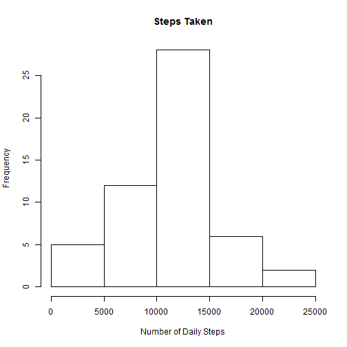
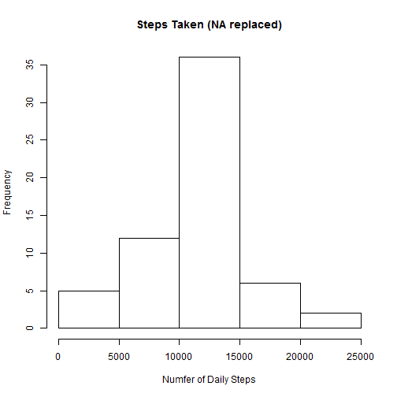
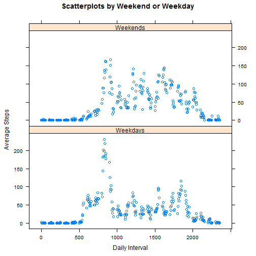

# Peer Assignment 1 - Reproducible Research

### Loading and preprocessing the data

Show any code that is needed to
- Load the data (i.e. read.csv())
- Process/transform the data (if necessary) into a format suitable for your analysis


```r
    data <- read.csv("activity.csv")
    library(dplyr)
```

This piece of code loads the csv file into R, and starts the 'dplyr' functionality which I use for a number of different functions.  I have chosen not to 'clean' the data, as I use 'na.rm' to ignore the NA variables in the code.

The "error" from 'dplyr' does not affect the functionality of this code.

### What is mean total number of steps taken per day?

For this part of the assignment, you can ignore the missing values in the dataset.
- Calculate the total number of steps taken per day
- If you do not understand the difference between a histogram and a barplot, research the difference between them. Make a histogram of the total number of steps taken each day
- Calculate and report the mean and median of the total number of steps taken per day


```r
    data      <- group_by(data, date)
    day.steps <- summarize(data, steps = sum(steps))

    hist(day.steps$steps, main = "Steps Taken", 
                          xlab = "Number of Daily Steps")
```

 

```r
    day.mean <- colMeans(day.steps[,2], na.rm = TRUE)
    cat("The daily mean is", day.mean)    
```

```
## The daily mean is 10766.19
```

```r
    day.med  <- median(day.steps$steps, na.rm = TRUE)
    cat("The daily median is", day.med)
```

```
## The daily median is 10765
```

### What is the average daily activity pattern?

- Make a time series plot of the 5-minute interval (x-axis) and the average number of steps taken, averaged across all days (y-axis)
- Which 5-minute interval, on average across all the days in the dataset, contains the maximum number of steps?


```r
    data        <- group_by(data, interval)
    nona        <- data[complete.cases(data),]
    fulldays    <- length(unique(nona$date))
    
    int.steps <- summarize(nona, steps = sum(steps))
    int.steps <- transform(int.steps, daily = steps / fulldays)
    int.steps <- int.steps[,c(1,3)]
    
    plot(int.steps$interval, int.steps$daily,
         main = "Average Steps per 5 Minute Interval",
         xlab = "5 Minute Interval",
         ylab = "Daily Average Steps")
```

 

```r
    max.val <- int.steps[which.max(int.steps$daily),1]
    cat("The interval with the maximum number of steps is", max.val)
```

```
## The interval with the maximum number of steps is 835
```

### Imputing missing values

Note that there are a number of days/intervals where there are missing values (coded as NA). The presence of missing days may introduce bias into some calculations or summaries of the data.
- Calculate and report the total number of missing values in the dataset (i.e. the total number of rows with NAs)
- Devise a strategy for filling in all of the missing values in the dataset. The strategy does not need to be sophisticated. For example, you could use the mean/median for that day, or the mean for that 5-minute interval, etc.
- Create a new dataset that is equal to the original dataset but with the missing data filled in.
- Make a histogram of the total number of steps taken each day and Calculate and report the mean and median total number of steps taken per day. Do these values differ from the estimates from the first part of the assignment? What is the impact of imputing missing data on the estimates of the total daily number of steps?

My strategy for filling in the missing values is to take the mean from each interval, and replace each interval's NA value with the mean value for that interval over the length of the study.  This is done in the following chunk of code.  In the previous chunk of code, I created a column called "daily" which is the number of steps per interval divided by the number of fulldays (excluding days that are entirely NA).  In this chunk, I create a column which tests for NA values, and either populates with the recorded "step" values or the average "daily" step value.


```r
    missing <- sum(is.na(data[,1]))
    cat("There are", missing, "missing values in this dataset.")
```

```
## There are 2304 missing values in this dataset.
```

```r
    data2 <- merge(data,int.steps)
    data2 <- within(data2, newsteps <- ifelse(is.na(steps), daily, steps))
```

Below, I take "data2" and make it an equivalent dataframe to "data", my original reading of the CSV file.  I call this file "data3", and use it for the rest of the assignment.


```r
    data3 <- data2[,c("newsteps", "date", "interval")]
    names(data3)[1] <- "steps"
    data3 <- data3[order(data3$date, data3$interval),]

    head(data)
```

```
## Source: local data frame [6 x 3]
## Groups: interval
## 
##   steps      date interval
## 1    NA 10/1/2012        0
## 2    NA 10/1/2012        5
## 3    NA 10/1/2012       10
## 4    NA 10/1/2012       15
## 5    NA 10/1/2012       20
## 6    NA 10/1/2012       25
```

```r
    head(data3)
```

```
##         steps      date interval
## 1   1.7169811 10/1/2012        0
## 63  0.3396226 10/1/2012        5
## 128 0.1320755 10/1/2012       10
## 205 0.1509434 10/1/2012       15
## 264 0.0754717 10/1/2012       20
## 327 2.0943396 10/1/2012       25
```

```r
    data3 <- group_by(data3, date)
    day.steps.na <- summarize(data3, steps = sum(steps))
    
    hist(day.steps.na$steps, main = "Steps Taken (NA replaced)",
                             xlab = "Numfer of Daily Steps")
```

 

```r
    day.mean.na <- colMeans(day.steps.na[,2])
    cat("The mean with NA values imputed is", day.mean.na)
```

```
## The mean with NA values imputed is 10766.19
```

```r
    day.med.na  <- median(day.steps.na$steps)
    cat("The median with NA values imputed is", day.med.na)
```

```
## The median with NA values imputed is 10766.19
```

The mean is no different than it was when we excluded NA values.  Intuitively we should assume this, as the only values we have added to our dataset are mean values.  In a simple example: the mean of (1,3,5) is no different if we include the mean of (1,3) and the mean of (3,5) to our dataset, giving us (1,2,3,4,5).

The median is slightly different, but the added values do not alter it dramatically.

### Are there differences in activity patterns between weekdays and weekends?

For this part the weekdays() function may be of some help here. Use the dataset with the filled-in missing values for this part.
- Create a new factor variable in the dataset with two levels - "weekday" and "weekend" indicating whether a given date is a weekday or weekend day.
- Make a panel plot containing a time series plot of the 5-minute interval (x-axis) and the average number of steps taken, averaged across all weekday days or weekend days (y-axis).

I could not determine how to manipulate this data within the context of a single dataframe.  Ultimately, I created two dataframes ("wkday", "wkend"), summarized each separately, and combined them into one data set ("combo").  This works perfectly well, but there are a lot of extra steps.


```r
    library(lattice)

    data3$day <- weekdays(as.Date(data3$date, "%m/%d/%Y"))
    data3     <- within(data3, wkday <- ifelse(day == "Saturday" | day == "Sunday", 0,1))

    wkday.df  <- data3[data3$wkday == 1,]
    wkend.df  <- data3[data3$wkday == 0,]

    fullwkd   <- length(unique(wkday.df$date))
    fullwend  <- length(unique(wkend.df$date))

    wkday.df    <- group_by(wkday.df, interval)
    wkday.steps <- summarize(wkday.df, steps = sum(steps))
    wkday.steps <- transform(wkday.steps, daily = steps / fullwkd)
    wkday.steps <- wkday.steps[,c(1,3)]
    wkday.steps$type <- 1

    wkend.df    <- group_by(wkend.df, interval)
    wkend.steps <- summarize(wkend.df, steps = sum(steps))
    wkend.steps <- transform(wkend.steps, daily = steps / fullwend)
    wkend.steps <- wkend.steps[,c(1,3)]
    wkend.steps$type <- 0

    combo       <- rbind(wkday.steps, wkend.steps)

    attach(combo)
```

```
## The following objects are masked from combo (pos = 4):
## 
##     daily, interval
## 
## The following objects are masked from combo (pos = 5):
## 
##     daily, interval
## 
## The following objects are masked from combo (pos = 6):
## 
##     daily, interval
## 
## The following objects are masked from combo (pos = 7):
## 
##     daily, interval
## 
## The following objects are masked from combo (pos = 8):
## 
##     daily, interval
```

```r
    daytype <- factor(type, levels=c(1,0), labels = c("Weekdays", "Weekends"))
    xyplot(daily~interval | daytype, main="Scatterplots by Weekend or Weekday",
           xlab = "Daily Interval", ylab = "Average Steps", layout = (c(1,2)))
```

 


